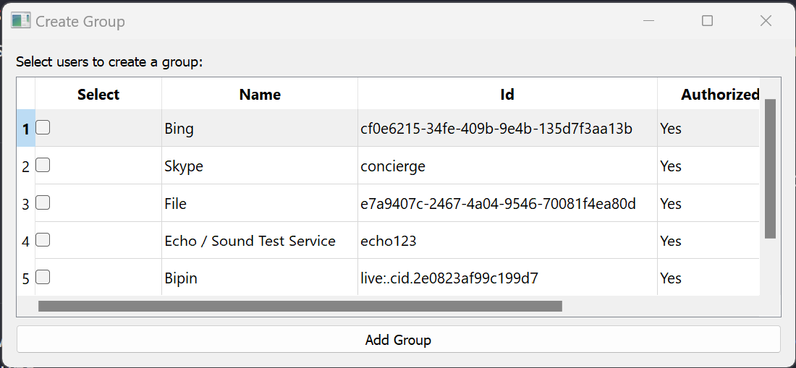

## skypy

The Application is a Python program built using PyQt5 that allows users to log in to their Skype accounts and create groups by selecting contacts from their contact list.

## Features

- User authentication: Users can log in to their Skype accounts by providing their username and password. The program uses the provided credentials to authenticate the user.
- Contact list display: After successful login, the program fetches the user's contact list and displays it in a table widget. The contact list includes information about each contact, such as their name, ID, and whether they are authorized.
- Group creation: Users can select contacts from the contact list by checking checkboxes in the table. After selecting the desired contacts, the user can create a new Skype group by clicking the "Add Group" button.
- Error handling: The application handles connection errors and provides feedback to the user in case of invalid credentials or other issues.

## Script Overview

The Python script consists of several classes that define the application's functionality:

1. **Data Class (Data):** This class is a simple data container that stores a single value.
2. **LoginWindow Class:** This class represents the login window of the application. Users can enter their Skype credentials, and upon successful login, they are taken to the data window.
3. **DataWindow Class:** This class is the main window of the application where users can create Skype groups. It displays the contact list, allows users to select contacts, and provides an option to create groups.
4. **ForwardWindow Class:** This class displays data forwarded from the main window (not utilized in the current application).

## Dependencies

The script uses the PyQt5 library for creating the GUI, and it relies on external functions for Skype authentication, contact retrieval, and group creation.

## How to Run

To run the Skype Group Creator Application, execute the script. The application will open the login window, and users can proceed to log in and create groups.

```
python main.py
```

Please note that the script references external functions for Skype-related actions, such as authentication and group creation, which are not provided in the script but are expected to be defined in the `utils.py` file.

## User Interface

The application's user interface consists of two main windows:

1. **Login Window:** Users enter their Skype credentials (username and password) to log in.

   
2. **Data Window (Main Window):** After successful login, users are presented with a table displaying their Skype contacts. They can select contacts and create Skype groups.
